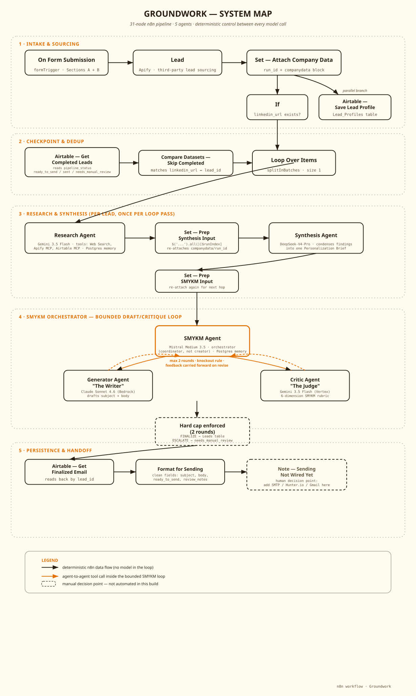
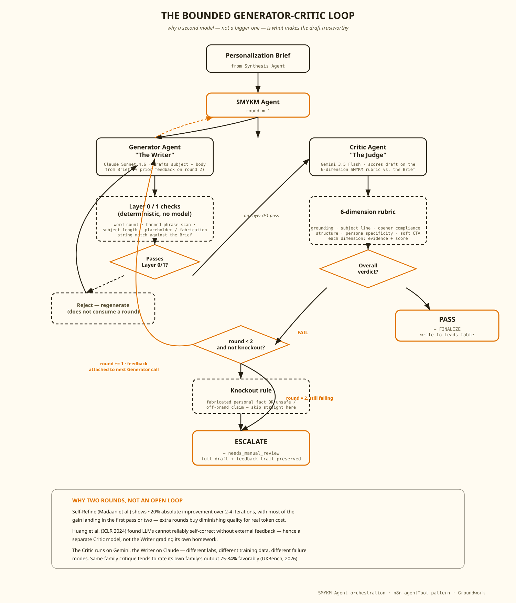
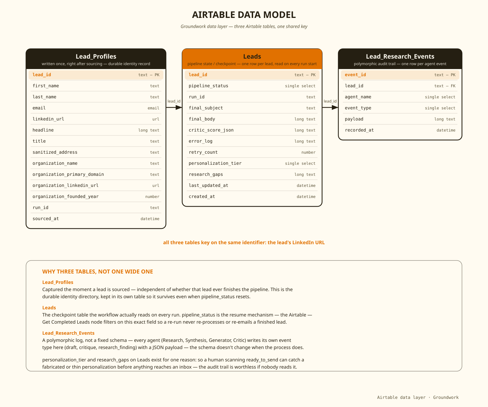

# Groundwork

**A production multi-agent AI system for B2B cold email, built to never fabricate a personal detail.**

Five purpose-built agents research a lead, draft an email, and cross-verify every claim in it before anything reaches an inbox — the research-before-writing work a human SDR would do by hand, done at a cost structure a small-to-mid-size company can actually run. n8n orchestration, five different LLMs across five different reasoning tasks, Airtable for state.

This repo contains the scrubbed, importable n8n workflow. Replace the placeholder IDs below with your own before running it — see [Setup](#setup).

---

## What this does

Most "AI personalization" is a first-name mail-merge token wearing a disguise. This pipeline does something structurally different: it separates *finding something true and specific about a person* from *writing convincingly*, because a single model asked to do both will reliably do the second at the expense of the first.

A lead goes in. Five agents run in sequence:

1. **Research Agent** — finds verifiable, source-linked personal facts about one person (a LinkedIn post, a podcast appearance, a talk they gave), never company-level trivia dressed up as personalization.
2. **Synthesis Agent** — condenses raw research into a single Personalization Brief, discarding anything without a source URL.
3. **Generator Agent** — drafts a subject and body using only what's in the Brief.
4. **Critic Agent** — an independent model, scoring the draft against a six-dimension rubric and checking every claimed fact against the Brief.
5. **SMYKM Agent** — a bounded orchestrator that runs the draft/critique cycle for a maximum of two rounds, then finalizes or escalates to a human. Never silently either one.

The output is either `ready_to_send` or `needs_manual_review`, written to Airtable with the full scoring trail attached. Sending itself is intentionally not wired up — see [Tradeoffs](#tradeoffs).

## Why it matters

Cold email reply rates fell from 8.5% to 3.43% between 2019 and 2026, across an industry that spent that entire period adding more AI, not less. A 12,000-email controlled study comparing AI-generated to human-written outreach found AI-alone campaigns landing a 4.1% reply rate against 10.4% for human-written email — and the researchers' own explanation was that every AI tool sounded monotonously the same. Technically correct, grammatically clean, and nobody was fooled by any of it.

The fix the same study points to: AI-assisted personalization works, but only when AI handles the research and a human-grade writing discipline stays intact. That's the entire architectural thesis behind this pipeline. It's built around Samantha McKenna's Show Me You Know Me® methodology — every email opens with a personal fact specific enough that it would mean nothing to anyone else — with an agent harness engineered specifically to make an AI system earn the right to use that format instead of faking it.

Run against a real batch of just over 100 emails, this pipeline measured a 6.6% reply rate and a 4% spam-flag rate: meaningfully ahead of the AI-alone baseline, on a sample honestly too small to call definitive.

## How it works

31 nodes, five stages, deterministic control between every model call.

**Intake and sourcing.** A form collects the sender's own company data (ICP, persona, offering, objections) once per campaign, plus targeting criteria that gets handed to a lead-sourcing tool keyed on LinkedIn URL. Every sourced lead is written to a `Lead_Profiles` table immediately, independent of whether it ever finishes the pipeline.

**Checkpoint and dedup.** Before any lead enters the expensive part of the pipeline, the workflow reads back everything already marked `ready_to_send`, `sent`, or `needs_manual_review` and skips it. A re-run never re-processes a finished lead.

**Research and synthesis.** Each lead is processed one at a time. The Research Agent has a hard 7-tool-call budget, a strict source-priority order (personal LinkedIn activity first, company press releases dead last), and a grading rubric: a fact only counts if it's personal-first, specific, source-linked, and recent.

**The bounded Generator/Critic loop.** The core of the system — a second, differently-reasoning model checks the first model's work, because self-review doesn't reliably catch what it can't see about itself.

**Persistence and handoff.** The finalized record is formatted into a clean `subject` / `body` / `ready_to_send` / `review_notes` payload, ready for a human to review or a sending integration to pick up.

Three Airtable tables carry all pipeline state, each for a distinct reason rather than an arbitrary split of one wide table:

## Setup

**Prerequisites**

- A self-hosted or cloud n8n instance (workflow uses `httpRequestTool`, `splitInBatches`, `compareDatasets`, and the LangChain agent/tool/memory node family — recent n8n version required)
- Credentials configured in n8n's credential store for: Alibaba Cloud (Qwen), an OpenAI-compatible endpoint (DeepSeek), Mistral Cloud, AWS Bedrock (Claude), Google Vertex AI (Gemini), Postgres (per-agent chat memory), Apify, and the Airtable MCP server
- A generic Query Auth credential (`httpQueryAuth`) holding a Google API key, attached to the **Web Search** node — this node calls the Vertex `generateContent` endpoint directly over HTTP rather than through a model node, so it needs its own credential
- An Airtable base with three tables matching the schema in the diagram above: `Leads`, `Lead_Research_Events`, `Lead_Profiles`

**Import and configure**

1. Import [`workflows/groundworksmykmpipeline.json`](workflows/groundworksmykmpipeline.json) into n8n.
2. Attach your own credentials to every model, memory, Apify, and Airtable node — none are pre-wired, by design.
3. Replace the placeholder values left in the JSON with your own:

   | Placeholder | Where | Replace with |
   |---|---|---|
   | `appYOUR_BASE_ID` | Airtable nodes | Your Airtable base ID |
   | `tblYOUR_LEADS_TABLE_ID` | Airtable nodes | Your `Leads` table ID |
   | `tblYOUR_LEAD_PROFILES_TABLE_ID` | Airtable nodes | Your `Lead_Profiles` table ID |
   | `YOUR_APIFY_ACTOR_ID` | `Lead` node | Your lead-sourcing actor's ID |
   | `your-gcp-project-id` | Google Vertex Chat Model node | Your GCP project ID |

4. The Research Agent and SMYKM Agent prompts both reference "the Airtable base configured for this workflow" — no further prompt edits needed once the nodes above point at your base.
5. Fill out the intake form once per campaign (your company data, ICP, targeting criteria) and run.

Sending is not wired up. The final node produces a clean `ready_to_send` payload — attach an SMTP, SendGrid, or Gmail node to actually send, once a human has reviewed anything flagged `needs_manual_review`.

## Tradeoffs

**Prompt chaining, not a super-orchestrator.** An earlier draft put a top-level supervisor agent in charge of the whole sequence. It was cut: this pipeline's steps are fixed and fully predictable at design time, the same five steps for lead #1 and lead #500, which is a prompt-chaining problem, not an orchestrator-workers one. A monitoring agent re-deriving "have I already tried twice?" from context on every lead is an unnecessary chance to miscount, and Anthropic's own published data puts that pattern's token cost at roughly 15x a single conversation.

**A second model judges, not a bigger one.** The Critic runs on a different model family than the Generator specifically because same-family critique measurably rubber-stamps: same-family judge models in one benchmark rated their own family's output as the winner 75–84% of the time.

**The two-round cap is self-counted, not code-enforced.** The system prompt instructs the orchestrator to track its own round count rather than a deterministic n8n IF/loop-counter node gating it from outside. Testing so far, including a live run that reached round two, shows this behaving correctly — but "behaving correctly so far" and "structurally guaranteed to" are different claims, and only one of them is true today. Anyone hardening this for production should move that check into a Code or IF node reading the Critic's JSON output directly.

**Airtable over Postgres.** Postgres would be the more conventional choice for pipeline state. Airtable won on a criterion that's easy to undervalue for a project meant to be inspected, not just run: anyone can open the base and see exactly what the pipeline did, without a separate admin tool.

**n8n over custom orchestration code.** A LangGraph or hand-rolled implementation would be at least as capable and wouldn't hit n8n-specific rough edges (this build ran into paired-item lineage breaking across a loop boundary, and an undocumented ceiling in the tool used to test-execute the workflow during development — both documented in commit history and the full case study). It won on legibility: a reviewer can open the canvas and see the shape of the system directly, without reading code.

---

The full case study — architecture reasoning, what broke during the build, and the measured numbers — is linked from my portfolio.

AI Engineer building production systems across automation, ML, and applied AI. Built with a business operator's mind.

MIT License — see [LICENSE](LICENSE).
